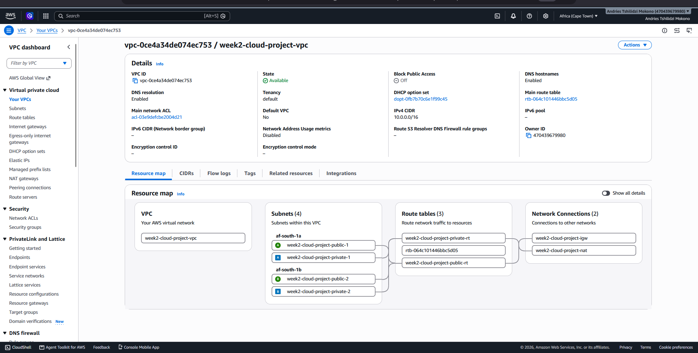
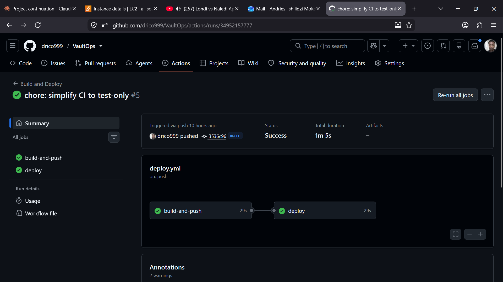
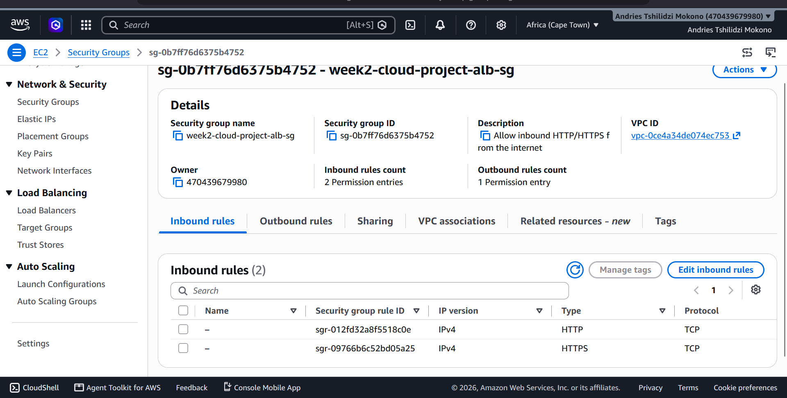
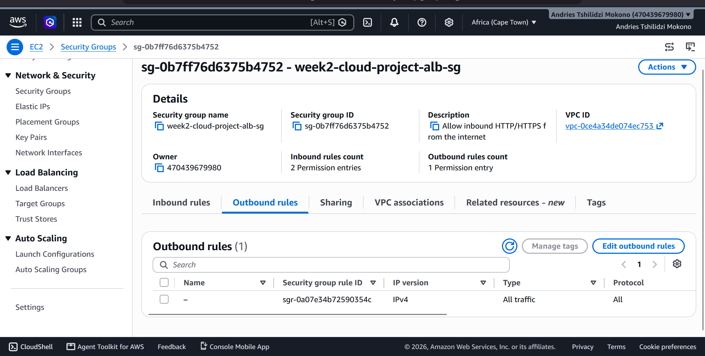
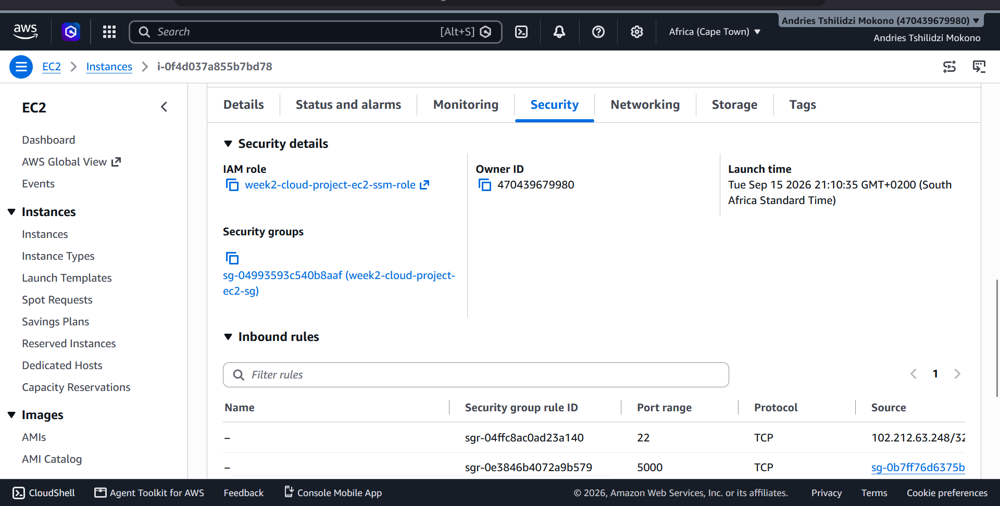
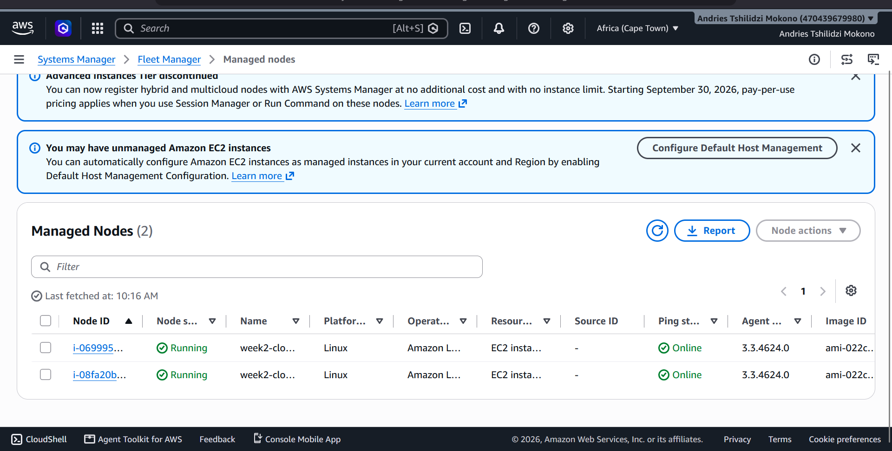
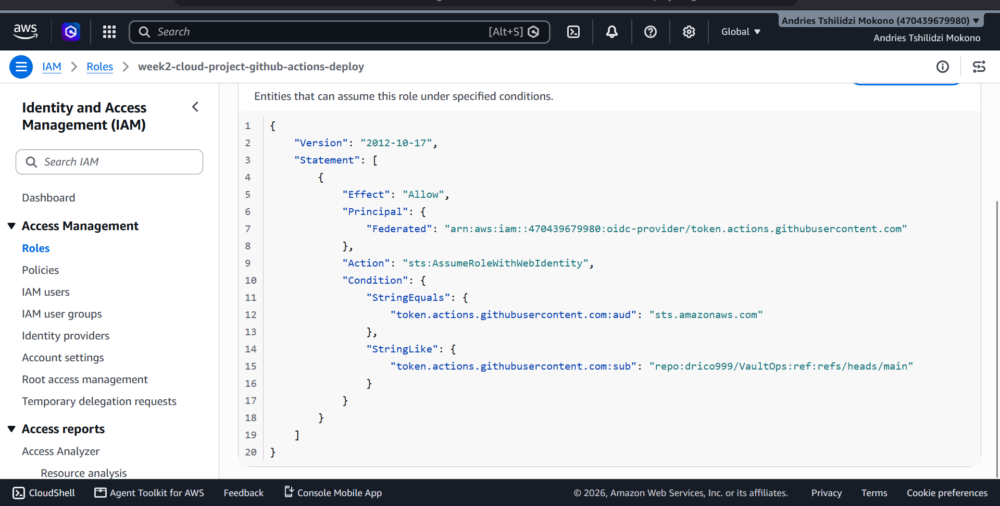
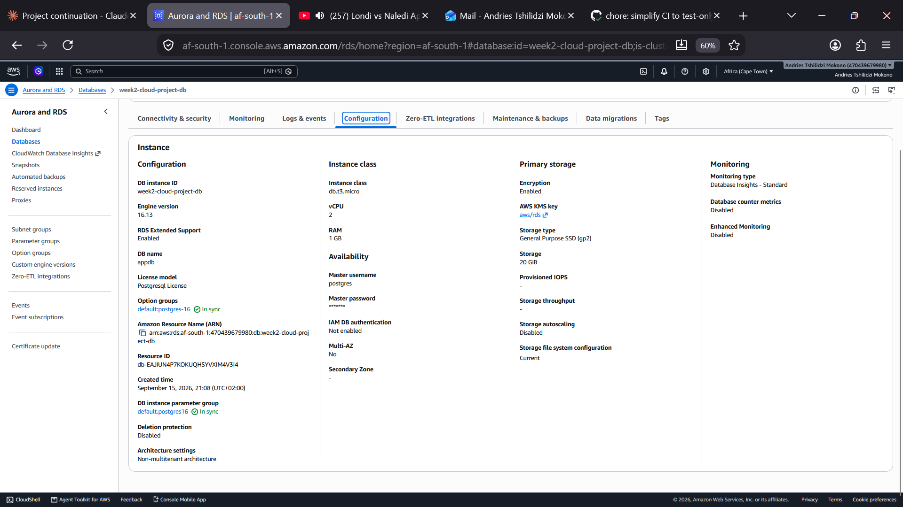
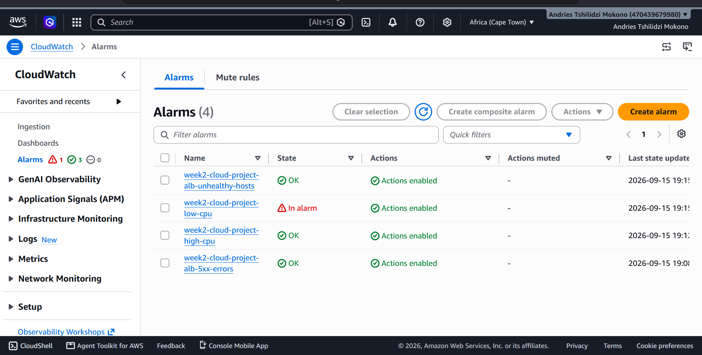
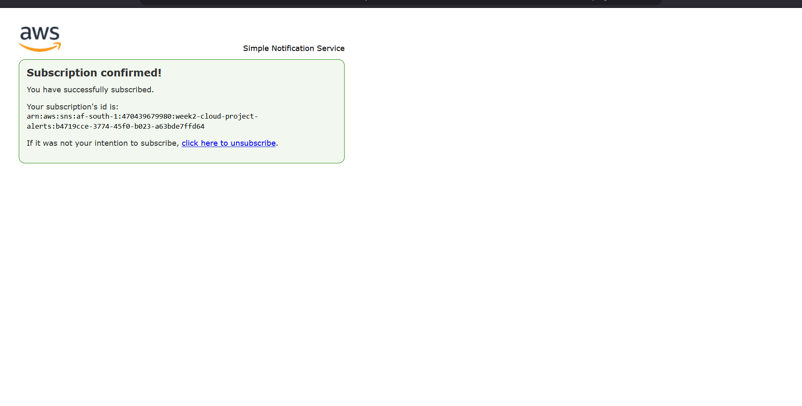

# VaultOps — Mid-Level Cloud Engineering Project

A scalable, containerized 3-tier web application deployed on AWS using Terraform and GitHub Actions CI/CD.

**Live URL:** `http://week2-cloud-project-alb-934119587.af-south-1.elb.amazonaws.com`
**Repository:** `drico999/VaultOps`

---

## 1. Overview

VaultOps is a Flask + PostgreSQL CRUD application ("Items" manager) deployed on AWS behind an Application Load Balancer, running on Auto Scaling EC2 instances, with infrastructure fully defined in Terraform and deployments automated through GitHub Actions.

The project was built over 4 weeks:

| Week | Focus |
|---|---|
| 1 | App build, containerization, GitHub repo |
| 2 | Terraform infrastructure (VPC, ALB, ASG, RDS) |
| 3 | CI/CD pipeline (GitHub Actions → Docker Hub → SSM deploy) |
| 4 | Monitoring, scaling, security hardening |

---

## 2. Architecture Overview

**Networking**
- Custom VPC (`10.0.0.0/16`) across 2 AZs (`af-south-1a`, `af-south-1b`)
- 2 public subnets (ALB, NAT Gateway) + 2 private subnets (EC2, RDS)
- Internet Gateway for public subnets; NAT Gateway for private subnet outbound access
- No public IPs on app or database instances

**Compute**
- Application Load Balancer → Target Group (port 5000) → Auto Scaling Group
- EC2 instances (Amazon Linux 2023, `t3.micro`) running the app in Docker, min 2 / max 4
- No bastion host — all instance access is via **AWS Systems Manager (SSM)**, not SSH

**Data**
- Amazon RDS PostgreSQL (`db.t3.micro`), private subnet only, encrypted at rest
- DB credentials stored in **SSM Parameter Store** as a `SecureString`, never in code or environment variables at rest

**DevOps**
- Terraform for all infrastructure (IaC)
- GitHub Actions for CI/CD, authenticating to AWS via **OIDC** (no static access keys)
- Docker Hub for image storage
- CloudWatch for logs, metrics, and alarms; SNS for alerting

```
Internet
   │
   ▼
[ALB :80] ──public subnets──
   │
   ▼
[Target Group :5000]
   │
   ▼
[Auto Scaling Group: 2-4x EC2 (Docker/Flask)] ──private subnets──
   │
   ▼
[RDS PostgreSQL, encrypted] ──private subnet──
```

**Screenshot:**


---

## 3. Deployment Steps

1. Clone the repo, set `TF_VAR_db_password` as an environment variable (never committed)
2. Fill in `terraform.tfvars` (region, project name, admin IP, GitHub org/repo, alert email, GitHub owner/repo numeric IDs)
3. `terraform init && terraform plan && terraform apply` in `week2-terraform/`
4. Confirm the SNS email subscription
5. In the GitHub repo: add repository variable `AWS_ROLE_ARN` (from Terraform output `github_actions_role_arn`)
6. Push to `main` — GitHub Actions builds the Docker image, pushes to Docker Hub, and deploys to both instances via SSM

**Screenshot:**


---

## 4. Security Design

Security was treated as a layered, least-privilege system rather than a checklist:

### 4.1 Network isolation
Three-tier security groups, each scoped to only the traffic it needs:
- **ALB SG**: 80/443 inbound from the internet, all outbound
- **EC2 SG**: 5000 inbound from the ALB SG *only* (not a CIDR), 22 inbound from one admin IP *only*, all outbound
- **RDS SG**: 5432 inbound from the EC2 SG *only* — the database is unreachable from anywhere else, including the internet

**Screenshots:**





### 4.2 No SSH-based access, no bastion
The project originally included a bastion host for SSH-based deploys. Once the deploy pipeline was rebuilt to use SSM `send-command` instead, the bastion became dead weight: an internet-facing instance with a security group open to SSH from `0.0.0.0/0`, doing nothing. It was removed entirely — the only path into app instances now is SSM, which requires no open inbound ports at all and is fully IAM-governed.

**Screenshot:**


### 4.3 No long-lived credentials anywhere
- **CI/CD**: GitHub Actions authenticates to AWS via **OpenID Connect (OIDC)**, not static `AWS_ACCESS_KEY_ID`/`AWS_SECRET_ACCESS_KEY`. Each workflow run gets a short-lived, auto-expiring credential scoped to a specific IAM role, which is itself scoped to this exact repository and branch via the token's `sub` claim.
- **EC2 instances**: use an IAM instance role (`AmazonSSMManagedInstanceCore` + a narrowly-scoped inline policy) instead of embedded access keys.
- **Database password**: stored in SSM Parameter Store as `SecureString`, fetched at boot by the instance role — never appears in Terraform state in plaintext, git history, or the launch template.

**Screenshot:**


### 4.4 Encryption
RDS storage is encrypted at rest using the AWS-managed KMS key.

**Screenshot:**


### 4.5 Least privilege IAM
Every IAM policy in this project is scoped to the specific actions and resources it needs — no wildcard `"Resource": "*"` where avoidable. The GitHub Actions deploy role, for example, can only call `ssm:SendCommand` against instances tagged `Name = week2-cloud-project-asg-instance`, and only using the `AWS-RunShellScript` document — not against arbitrary EC2 instances in the account.

---

## 5. Scaling Strategy

- Auto Scaling Group: min 2, max 4, desired 2
- **Scale out**: average CPU ≥ 70% for 2 consecutive minutes → +1 instance
- **Scale in**: average CPU ≤ 30% for 2 consecutive minutes → -1 instance
- Health checks via the ALB target group (`/health`, 30s interval), not just EC2 status checks — an instance that's "running" but not actually serving traffic correctly is still replaced
- Detailed (1-minute) CloudWatch monitoring enabled on all instances, so scaling alarms evaluate against real-time data rather than the default 5-minute granularity

**Screenshot:**


---

## 6. Monitoring Setup

Four CloudWatch alarms, all notifying an SNS topic (`week2-cloud-project-alerts`) with a confirmed email subscription:

| Alarm | Condition | Purpose |
|---|---|---|
| `high-cpu` | CPU ≥ 70% for 2 min | Triggers scale-out |
| `low-cpu` | CPU ≤ 30% for 2 min | Triggers scale-in |
| `alb-unhealthy-hosts` | Any target unhealthy for 2 min | Early warning independent of scaling |
| `alb-5xx-errors` | >10 backend 5xx in 5 min | Catches app-level failures, not just infra failures |

**Screenshots:**





Container logs ship to CloudWatch Logs (`/week2-cloud-project/app`).

---

## 7. Cost Estimation (af-south-1, monthly, approximate)

| Resource | Est. cost |
|---|---|
| 2× `t3.micro` EC2 (avg) | ~$15 |
| NAT Gateway (hourly + data processing) | ~$35 |
| Application Load Balancer | ~$18 |
| RDS `db.t3.micro` (single-AZ) | ~$13 |
| Detailed monitoring (2 instances) | ~$4 |
| CloudWatch Logs / Alarms / SNS | <$2 |
| **Total (rough)** | **~$85-90/month** |

The NAT Gateway is the single largest line item — a known trade-off for keeping app/DB instances fully private with no public IPs. Free Tier covers a meaningful portion of the EC2 and RDS costs for the first 12 months.

---

## 8. Challenges & Solutions

This section documents real issues hit during Week 4 — kept because the troubleshooting process is itself evidence of understanding the stack, not just following a tutorial.

**1. Zero SSM-managed instances despite correct IAM, networking, and security groups**
Root cause: the AMI filter (`al2023-ami-*-x86_64`) matched both the standard Amazon Linux 2023 image and the *minimal* variant — and `most_recent = true` happened to select the minimal one. The minimal AMI doesn't ship with SSM Agent preinstalled. Fixed by tightening the filter to `al2023-ami-2023.*-x86_64`, which excludes the minimal variant.

**2. GitHub OIDC authentication failing with "Not authorized to perform sts:AssumeRoleWithWebIdentity" despite a correct-looking trust policy**
Root cause: the repository used GitHub's newer *immutable subject claim* format, which embeds the numeric owner ID and repo ID in the token's `sub` claim (`repo:owner@ownerID/repo@repoID:...`) instead of the plain `repo:owner/repo:...` format the trust policy expected. Diagnosed by decoding the actual OIDC token claims in a temporary debug step in the workflow, rather than guessing. Fixed by updating the trust policy condition to match the real format.

**3. `ssm:SendCommand` AccessDenied despite a seemingly correct tag-scoped IAM policy**
Root cause: the Auto Scaling Group's own `tag` block (with `propagate_at_launch = true`) overrides the launch template's `tag_specifications` at instance launch — so the real `Name` tag on running instances (`*-asg-instance`) didn't match what the IAM policy condition expected (`*-app`). Fixed by aligning the policy condition with the tag the ASG actually applies.

**4. `high-cpu` alarm not firing despite CPU visibly spiking during load tests**
Root cause: EC2 basic monitoring only reports CPUUtilization every 5 minutes, but the alarm's 60-second period needs 2 *consecutive* 1-minute datapoints above threshold — a brief spike under basic monitoring registers as a single isolated point. Fixed by enabling detailed (1-minute) monitoring on the launch template.

**5. ALB DNS name unreachable after infrastructure changes**
Root cause: the load balancer had been recreated (new random suffix in its DNS name) after an environment rebuild, and testing was done against a stale, no-longer-existent hostname. Resolved by re-fetching the current DNS name from the console rather than assuming a previously-known one was still valid — a reminder to always re-verify outputs after any `apply` that touches stateful-adjacent resources.

---

## 9. Repository Structure

```
VaultOps/
├── app.py, Dockerfile, requirements.txt   # Week 1 — application
├── .github/workflows/deploy.yml           # Week 3/4 — CI/CD (OIDC-based)
└── week2-terraform/
    ├── main.tf, providers.tf, variables.tf, terraform.tfvars
    ├── compute.tf          # ALB, ASG, launch template
    ├── autoscaling.tf      # scaling policies + CPU alarms
    ├── database.tf         # RDS
    ├── security_groups.tf  # 3-tier SGs
    ├── ssm.tf               # IAM role, SSM parameter
    ├── oidc.tf              # GitHub OIDC provider + deploy role
    ├── sns_alarms.tf        # SNS topic + ALB alarms
    ├── bastion.tf            # SSH key pair only (bastion removed)
    └── outputs.tf
```
